<div align="center">

# ✈️ Rihlati Airlines

**A full-stack airline booking platform** — search real schedules, pick a seat,
pay, and manage the trip. With an operations dashboard behind it.

Bilingual English / Arabic, right-to-left throughout.

[](https://react.dev)
[](https://vite.dev)
[](https://laravel.com)
[](https://www.mysql.com)
[](#license)

**[🌐 Live demo](#live-demo)** ·
[Getting started](#getting-started) ·
[Features](#what-it-does) ·
[Architecture](#architecture) ·
[API](#api) ·
[Deployment](#deployment)

</div>

---

## Live demo

| | |
| --- | --- |
| 🌐 **Website** | **<https://rihlati-airline.vercel.app>** |
| 🔐 **Dashboard** | <https://rihlati-airline.vercel.app/login> |

> **Everything works on the hosted demo** — search the timetable, pick a fare,
> book a seat, look the booking up by its reference, and sign in to the
> operations dashboard.
>
> Free static hosting cannot run Laravel or MySQL, so the preview ships a
> browser-side twin of the API (`client/src/shared/lib/demo/`). It mirrors the
> seeders and the API resources: the same 24 routes from the Dubai hub, the same
> departure slots and fare rules, regenerated from today's date. Everything you
> do is held in **your own browser** and disappears when you reload.
>
> It runs only when `VITE_DEMO_MODE` is true, which `vercel.json` sets for the
> hosted build alone. Run the project locally — see
> [Getting started](#getting-started) — and the real Laravel + MySQL API answers
> instead, which is the configuration to judge the code by.

### Sign in

| Role | Email | Password | What you can do |
| ---- | ----- | -------- | --------------- |
| 👑 **Administrator** | `admin@rihlati.demo` | `Admin@12345` | Everything — create, edit and delete flights, change booking status |
| 👔 **Operations staff** | `staff@rihlati.demo` | `Staff@12345` | Read the dashboard, view manifests |
| 🧳 **Customer** | `omar.haddad@example.com` | `Traveller@123` | Book and manage trips |

### Book a flight in 60 seconds

1. Open **`/flights`**, type `DXB` and `LHR`, pick a date a few days out, set 2 passengers, **Search**.
2. Choose a fare on the **outbound**, then on the **return** — the bar at the bottom keeps the total.
3. **Continue** → fill in the travellers and a contact email.
4. Pick seats, or skip and they are assigned for you.
5. Pay with any card number starting **`4242`** (e.g. `4242 4242 4242 4242`, exp `09/29`, CVC `123`).
6. You get a real booking reference. Look it up any time at **`/manage-booking`**.

> Everything is real: the flights come from the database, the seat you pick is
> locked so nobody else can take it, and the booking appears in the dashboard
> immediately.

---

## What it does

### For travellers

| | |
| --- | --- |
| 🔍 **Flight search** | Live schedule across 25 destinations, filtered by cabin, price and sort order. The search lives in the URL, so a result set can be shared or bookmarked. |
| 🎫 **Booking in three steps** | Travellers → seats → payment, with per-field validation and a running fare summary. Reloading mid-flow does not lose your place. |
| 🪑 **Interactive seat map** | Real availability per cabin. Two people can never be sold the same seat — the database enforces it. |
| 💳 **Checkout** | Card entry with brand detection. Only the brand and last four digits ever reach the server. |
| 📧 **Confirmation** | A booking reference (PNR), a printable ticket, and a confirmation email. |
| 📋 **Manage booking** | Look a trip up by reference and email; cancel it and the seats return to inventory with the payment refunded. |
| 🎟️ **Offers** | Promo codes validated before you pay, with the discount shown up front. |

### For operations

| | |
| --- | --- |
| 📊 **Dashboard** | Revenue by month, bookings by status, busiest routes, cabin mix, load factors. |
| ✈️ **Flight management** | Create, edit and withdraw flights with per-cabin pricing and capacity. A flight with bookings cannot be deleted — it is cancelled instead. |
| 👥 **Passenger manifest** | Everyone on a flight with their seat, cabin, reference and check-in state. Exports to CSV for ground staff. |
| 🔐 **Roles** | Administrators write; operations staff read. Enforced on every API route, not just in the UI. |
| 🧾 **Audit log** | Every administrative action, with who did it and from where. |

---

## Screens

### The booking flow

| Search — outbound and return chosen separately | Seats — live availability per cabin |
| :--: | :--: |
| 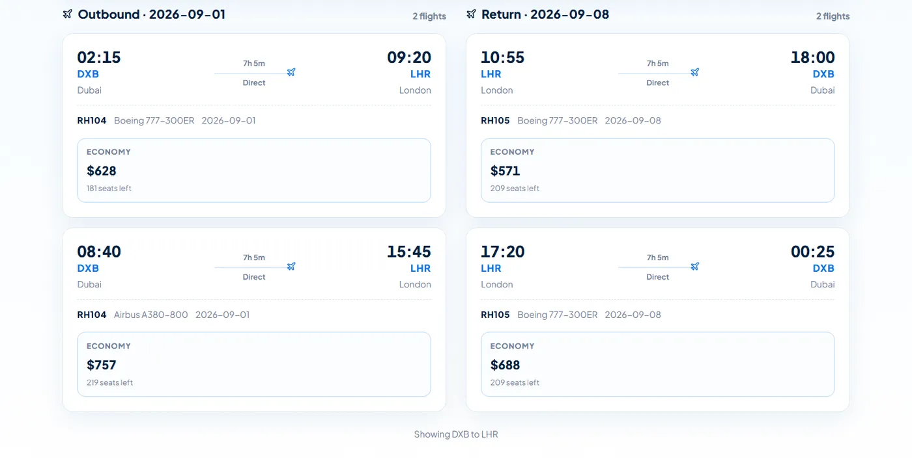 | 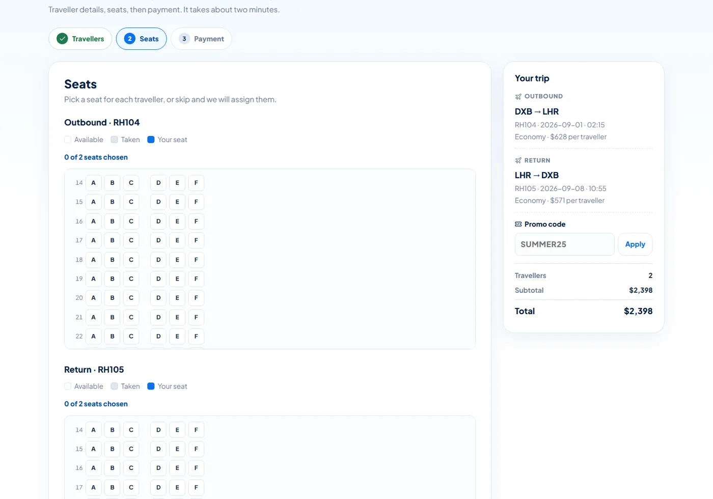 |

| Payment — brand detected, nothing sensitive stored | Confirmation — PNR, seats, printable ticket |
| :--: | :--: |
| 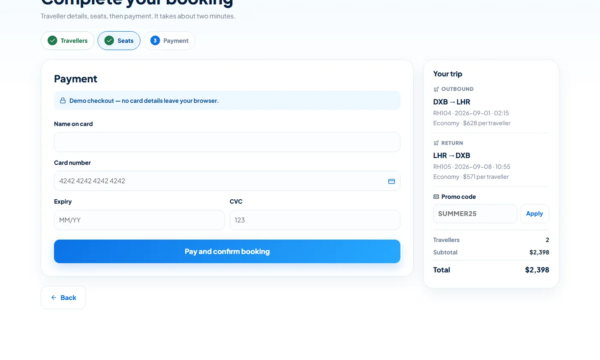 | 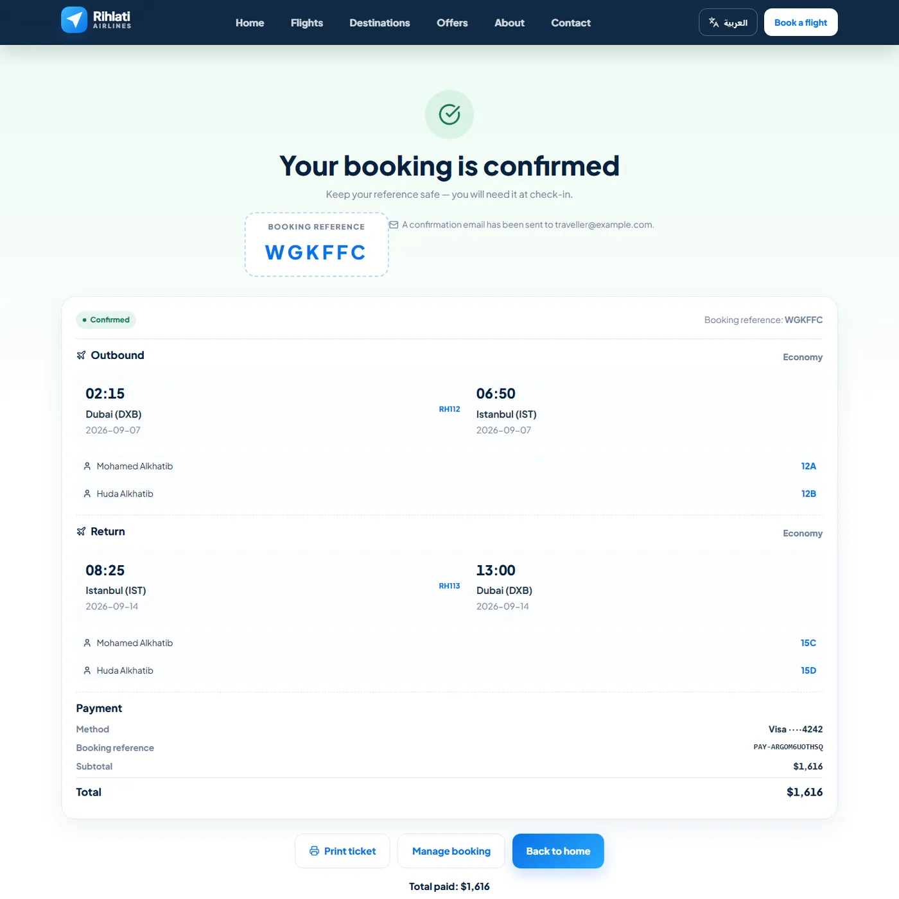 |

### The site

| | |
| :--: | :--: |
|  | 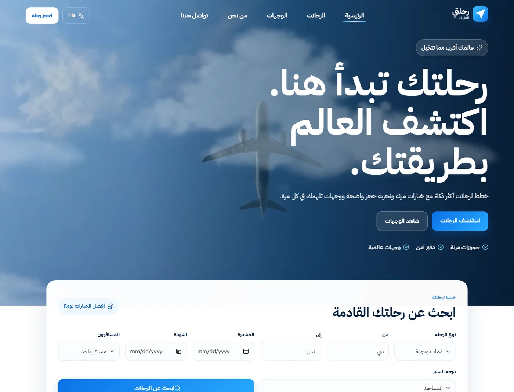 |
| **Home** | **The same page in Arabic** — the layout mirrors, gradients reverse, arrows flip |
| 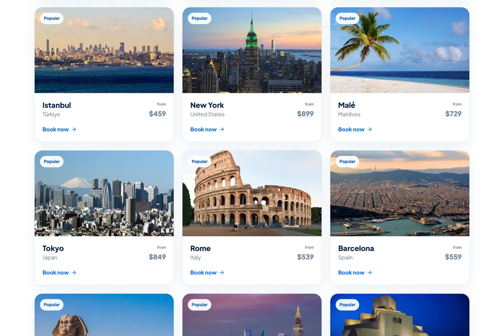 | 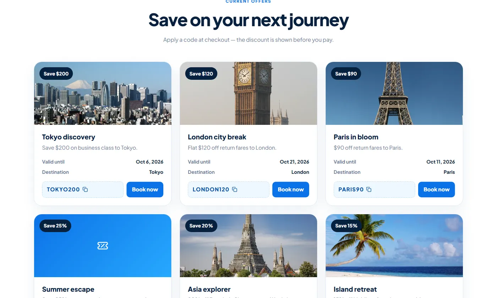 |
| **25 destinations**, real photography | **Offers** with copyable promo codes |
| 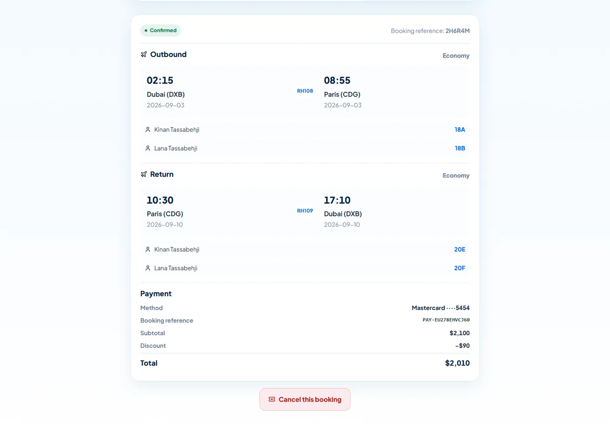 | |
| **Manage booking** — look a trip up, see every traveller's seat, cancel it | |

### The dashboard

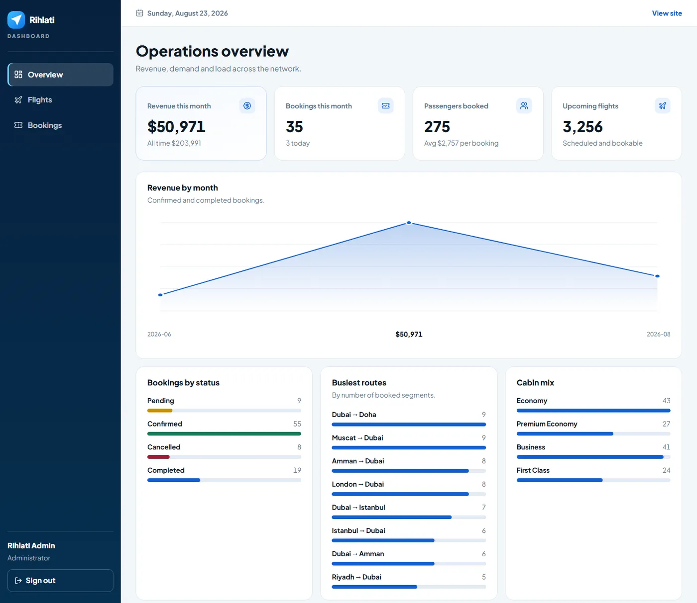

| | |
| :--: | :--: |
| 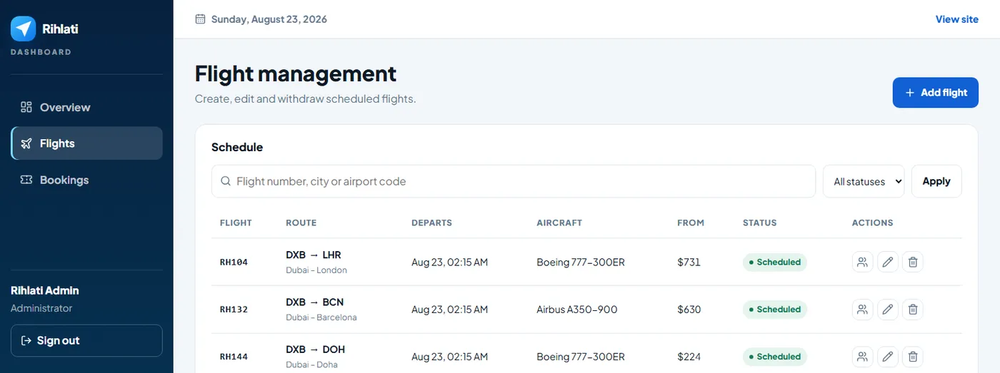 | 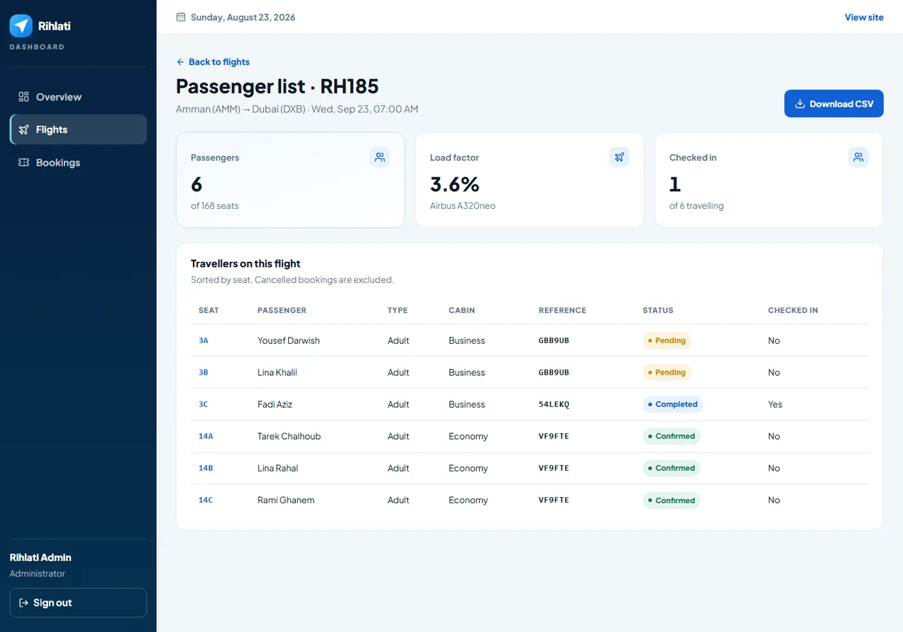 |
| **Flight management** — create, edit, withdraw | **Passenger manifest** — names, seats, CSV export |

---

## Getting started

Full instructions, including a Windows/XAMPP walkthrough, are in
**[docs/SETUP.md](docs/SETUP.md)**. The short version:

```bash
git clone https://github.com/mohamedAlkhatib5/Rihlati_airline.git
cd Rihlati_airline

# API — http://127.0.0.1:8000
cd server
composer install
cp .env.example .env          # then set APP_KEY and JWT_SECRET
php artisan key:generate
php artisan migrate --seed
php artisan serve --port=8000

# Front-end — http://localhost:5173
cd ../client
npm install
npm run dev
```

The seeder loads 25 destinations, ~3,300 flights, 90 bookings with passengers
and seats, and 8 offers — so the app is usable the moment it starts.

Sign-in details are in [Live demo](#live-demo) above.

---

## Architecture

```text
Rihlati_airline/
├── client/                     React 19 + Vite 7
│   ├── scripts/                Image pipeline (fetch + optimise)
│   └── src/
│       ├── app/                Shell: providers, route table, lazy routes
│       ├── features/           One folder per product area
│       │   ├── home/  flights/  booking/  destinations/
│       │   ├── offers/  manage-booking/  auth/  admin/
│       │   └── about/  contact/  not-found/
│       │       ├── <Feature>Page.jsx
│       │       ├── components/  hooks/  api/  constants/  styles/
│       │
│       ├── shared/             Used by more than one feature
│       │   ├── components/     brand · layout · ui · feedback
│       │   ├── hooks/  lib/  constants/  styles/
│       │
│       ├── i18n/               i18next + locales/{en,ar}.json
│       └── assets/
│           ├── images-src/     Originals (not committed)
│           └── images/         Generated WebP/JPEG + manifest
│
├── server/                     Laravel 13 REST API
│   ├── app/
│   │   ├── Http/
│   │   │   ├── Controllers/Api/V1/       Public + Admin
│   │   │   ├── Middleware/               JWT verify, role gate
│   │   │   └── Resources/                JSON shaping
│   │   ├── Models/                       14 Eloquent models
│   │   ├── Services/                     BookingService, SeatAllocator, TokenService
│   │   └── Mail/                         Booking confirmation
│   ├── database/
│   │   ├── migrations/                   15 migrations
│   │   └── seeders/                      Airports, fleet, flights, bookings…
│   └── routes/api.php                    33 routes under /api/v1
│
└── docs/                       Setup guide, image credits
```

### Why this shape

- **Feature-first, not type-first.** Everything booking needs lives in
  `features/booking`. A change touches one folder, not five.
- **`shared/` earns its place.** A component moves there the second time it is
  needed, not the first.
- **Design tokens are the single source of truth.** Colour, spacing, radius,
  typography and motion live in `shared/styles/tokens.css`.
- **Copy lives in `i18n/locales`.** A third language is one JSON file.
- **The service layer owns the rules.** Controllers handle HTTP; `BookingService`
  decides what a valid booking is.

### Data model

Fourteen tables. Two decisions worth calling out:

- **Inventory sits on `fare_classes`, not on the flight** — economy can sell out
  while business is still open.
- **Seat uniqueness is per *flight*, not per booking segment.** Scoped to the
  segment, two separate bookings could each be assigned 12A. A composite unique
  index on `(flight_id, seat_number)` makes that impossible at the database
  level, not just in application code.

Bookings are created inside a transaction and reserve seats with a *conditional*
decrement, so two people clicking "pay" on the last seat cannot both succeed.

---

## API

Thirty-three routes under `/api/v1`. Public routes need no token; the dashboard
needs a bearer token and the right role.

<details>
<summary><b>Public</b></summary>

```http
GET    /api/v1/health
GET    /api/v1/destinations               ?featured=1&region=europe
GET    /api/v1/destinations/{slug}
GET    /api/v1/flights/search             ?from&to&departure&returnDate&passengers&cabin&sort&maxPrice
GET    /api/v1/flights/{id}/seat-map      ?cabin=economy
GET    /api/v1/offers
POST   /api/v1/offers/validate            { code, subtotal }
POST   /api/v1/bookings                   { fares, passengers, seats, payment }
GET    /api/v1/bookings/{pnr}             ?email=
POST   /api/v1/bookings/{pnr}/cancel      { email }
POST   /api/v1/contact
POST   /api/v1/newsletter
```

</details>

<details>
<summary><b>Authentication</b></summary>

```http
POST   /api/v1/auth/register
POST   /api/v1/auth/login
POST   /api/v1/auth/refresh
GET    /api/v1/auth/me                    (bearer)
POST   /api/v1/auth/logout                (bearer)
```

HS256 JWT. Login is rate-limited per email and IP, and an unknown email returns
the same message as a wrong password, so accounts cannot be enumerated.

</details>

<details>
<summary><b>Dashboard</b> — staff read, admin writes</summary>

```http
GET    /api/v1/admin/stats
GET    /api/v1/admin/options
GET    /api/v1/admin/flights              ?q&status&date&page
GET    /api/v1/admin/flights/{id}/manifest
GET    /api/v1/admin/flights/{id}/manifest.csv
GET    /api/v1/admin/bookings             ?q&status&page
GET    /api/v1/admin/messages | users | audit-logs

POST   /api/v1/admin/flights              (admin)
PUT    /api/v1/admin/flights/{id}         (admin)
DELETE /api/v1/admin/flights/{id}         (admin)
PATCH  /api/v1/admin/bookings/{id}/status (admin)
```

</details>

---

## Performance

The image pipeline is the largest single win: originals are never shipped.

| | Before | After |
| --- | --- | --- |
| Home page images | ~11.2 MB | **~230 KB** |
| Destination card | 1.2–5.2 MB | 23–62 KB |
| CSS | 51 KB gzip | **36 KB gzip** |
| Icon font | 134 KB | **0** — tree-shaken SVG |

- Routes are code-split and prefetched while the browser is idle, so navigation
  never shows a loading screen.
- Dashboard chunks are excluded from that prefetch: a visitor who never signs in
  downloads none of it.
- Every image carries intrinsic dimensions, so nothing shifts as it loads.

## Accessibility

- Every form control is wired to its label, with `aria-invalid` and
  `aria-describedby` on error.
- One visible focus ring, defined once.
- Skip link, and focus moves to `<main>` on every route change.
- Status messages are live regions.
- Motion respects the operating system's reduce-motion setting.
- Dashboard status colours are validated for colour-vision deficiency and always
  paired with a text label — never colour alone.

## Security

- Passwords hashed with bcrypt; roles checked on the API, not only in the UI.
- Access token held in memory, never in `localStorage`.
- Card numbers never reach the server.
- A booking reference alone reveals nothing — the contact email must match.
- Every query is parameterised through Eloquent.
- Secrets live in `.env`, which is not committed. `.env.example` documents them.

---

## Deployment

The front-end is a static bundle; the API needs PHP and MySQL. They deploy
separately.

### Front-end — Vercel

1. Import the repository, set **Root Directory** to `client`.
2. Vercel detects Vite; the build command and output directory are already in
   `client/vercel.json`.
3. Edit the `/api/:path*` rewrite in `vercel.json` to point at your API host.

### API — any PHP 8.2 host

Railway, Render, Fly.io and most shared hosts work. Set the document root to
`server/public`, then:

```bash
composer install --no-dev --optimize-autoloader
php artisan migrate --force
php artisan config:cache && php artisan route:cache
```

Set `APP_ENV=production`, `APP_DEBUG=false`, a fresh `JWT_SECRET`, and
`FRONTEND_URL` to your deployed front-end so CORS allows it.

The repository root carries a `vercel.json` that builds `client/` and serves it
as a single-page app, so pushing to `main` deploys the front-end automatically.

Once the API is hosted, add a rewrite above the SPA catch-all so the browser
keeps talking to one origin:

```json
{ "source": "/api/:path*", "destination": "https://YOUR-API-HOST/api/:path*" }
```

---

## Scripts

| Command | What it does |
| ------- | ------------ |
| `npm run dev` | Vite dev server with hot reload |
| `npm run build` | Production build into `client/dist` |
| `npm run preview` | Serve the production build |
| `npm run format` | Prettier over `src/` |
| `npm run images:fetch` | Download destination photographs |
| `npm run images:build` | Generate responsive variants |
| `php artisan migrate --seed` | Build and populate the database |
| `php artisan serve` | Run the API |

---

## Roadmap

| Phase | Scope | Status |
| ----- | ----- | ------ |
| 1 | Images, focus states, form labels, code splitting | ✅ |
| 2 | Feature architecture, design tokens, i18n, accessibility | ✅ |
| 3 | Laravel API, MySQL schema, migrations, seeders | ✅ |
| 4 | Flight search, booking flow, seat map, offers, lookup | ✅ |
| 5 | JWT authentication | ✅ |
| 6 | Operations dashboard | ✅ |
| 7 | ESLint, tests, CI, SEO, deployment | ⬜ Next |

Beyond that: online check-in, boarding passes, loyalty points, multi-leg
itineraries, and a real payment gateway.

---

## Credits

Destination photographs come from Wikimedia Commons under their respective free
licences — see [docs/IMAGE-CREDITS.md](docs/IMAGE-CREDITS.md).

## License

MIT. Rihlati is a fictional airline built as a portfolio project.
